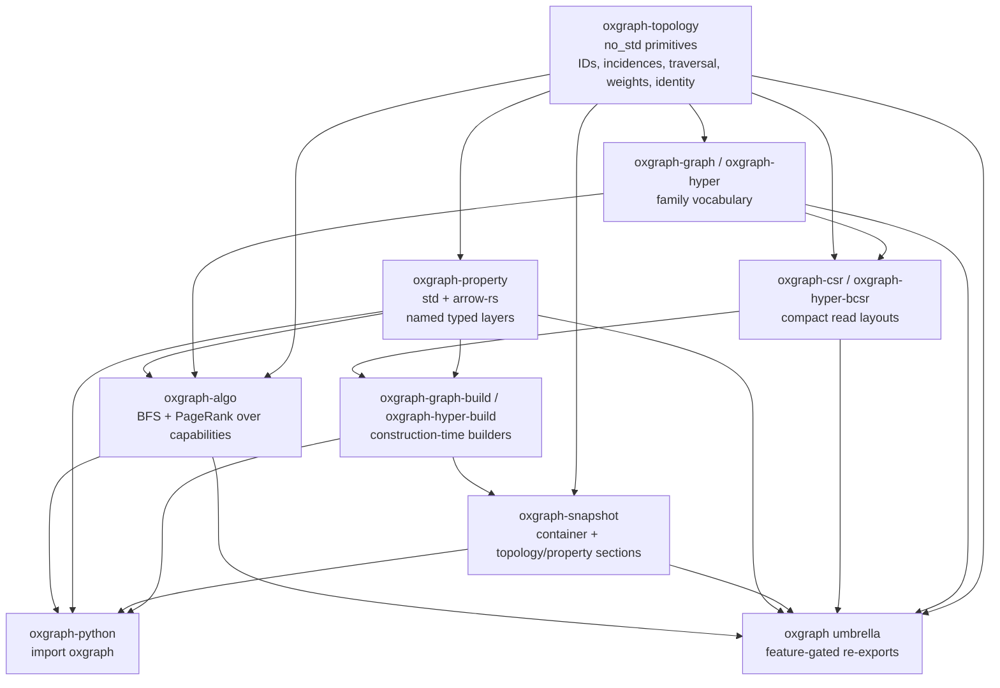
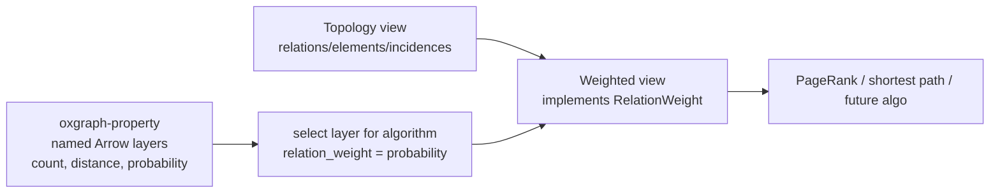
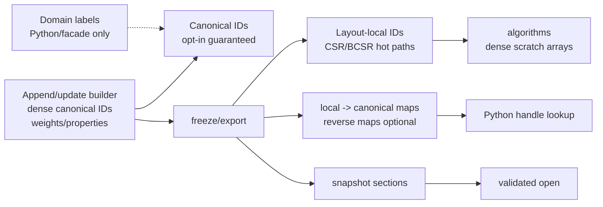
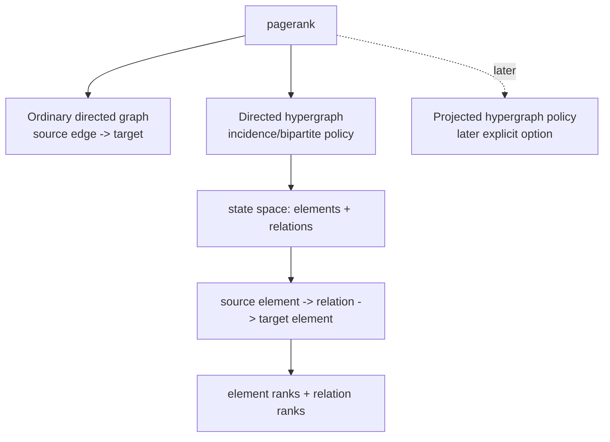
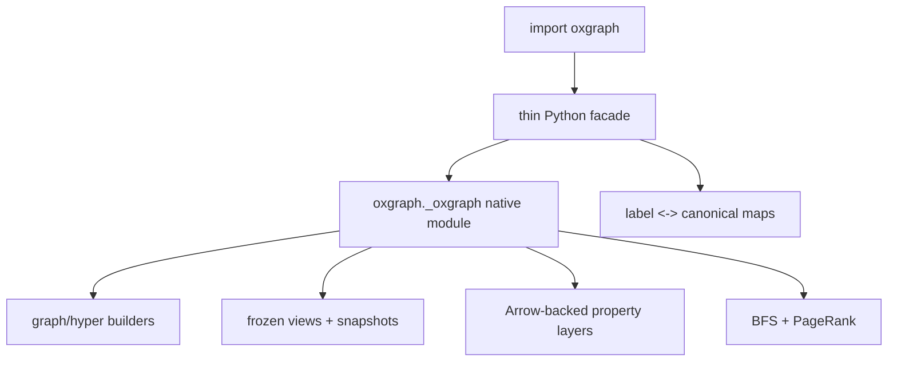

# Plan: expose oxgraph to Python with weighted topology foundations

## Context

- This plan is OxGraph-only. `../birdsong` was inspected only as a motivating downstream fixture; no birdsong code or dependency changes are in scope.
- The project vision remains: **Topology here. Meaning elsewhere. Storage anywhere.** OxGraph should be a foundational, substrate-agnostic topology engine, not a property graph framework, graph database, or clone of another graph library.
- The deepest crates stay minimal and `no_std` where possible. Higher layers may use `std` when their job requires builders, Arrow-backed properties, Python, or interop.
- `.shapes/` is canonical and must be updated before implementation.
- Existing relevant crates:
  - `oxgraph-topology` — shared topology traits and vocabulary.
  - `oxgraph-graph` / `oxgraph-hyper` — graph/hypergraph vocabulary wrappers.
  - `oxgraph-csr` / `oxgraph-hyper-bcsr` — compact read layouts.
  - `oxgraph-snapshot` — snapshot container.
  - `oxgraph-algo` — BFS plus verified ordinary-graph and incidence/bipartite hypergraph PageRank APIs.
  - `oxgraph` — umbrella crate.
- Supporting decision/research notes:
  - `plans/oxgraph-design-decisions.md`
  - `plans/arrow-rs-property-research.md`
  - `plans/ranking-naming-research.md`
  - `plans/petgraph-architecture-research.md`

## Current implementation status — completed 2026-05-06

The remaining OxGraph-only Python-binding punch list has been implemented in this branch.
The completion pass added amendment 9, reconciled the shape graph, filled the property/snapshot/builder/PageRank/Python gaps called out by the audit, and verified the result with `shapes validate`, `just ci`, and Python smoke tests.

Legend:

- ✅ Implemented in the current branch with local verification.

| Area | Status | Completed state | Verification/evidence |
| --- | --- | --- | --- |
| Shapes and architecture docs | ✅ | Shapes 19–24 record amendment 9; `docs/architecture.md` documents the internal v1 identity/property sections and the Python-enabling architecture. | `shapes validate`; amendment log entries on target shapes. |
| Topology weights and identity | ✅ | `ElementWeight`, `RelationWeight`, `IncidenceWeight`, canonical/local identity traits, and graph/hyper static-dispatch coverage are present. | Static-dispatch tests, docs/perf contracts, and existing bounded proof/skip policy. |
| Hypergraph capability expansion | ✅ | Directed hyperedge incidence and vertex hyperedge traversal remain intact while builder exports now satisfy strict BCSR validation. | BCSR tests plus hyper builder duplicate/unsorted tests and proptests. |
| `oxgraph-property` | ✅ | Dense and sparse f64 Arrow-backed layers, sparse totalizing selected weight views, Arrow value-family classification, identity/property snapshot encoding/validation, descriptor/default/type checks, tests, proptests, benchmarks, and Kani skip rationale are present. | Unit tests, proptests, `crates/oxgraph-property/benches/property.rs`, `// kani-skip` rationale. |
| Graph builder | ✅ | Append/update graph builder supports element/relation weights, local==canonical identity, owned freeze, CSR export with identity/property sections, checked Python accessors, proptests, and benchmarks. | Unit tests, graph builder proptest, `crates/oxgraph-graph-build/benches/builder.rs`. |
| Hypergraph builder | ✅ | Append/update hypergraph builder rejects duplicate same-side participants, normalizes participant sets for strict BCSR export, supports element/relation/incidence weights, identity/property snapshot sections, proptests, and benchmarks. | Unit tests, hyper builder proptest, strict BCSR open tests, `crates/oxgraph-hyper-build/benches/builder.rs`. |
| Snapshot identity/property persistence | ✅ | Internal v1 identity-mode/map and property descriptor/data sections are encoded and validated while the base container stays topology-agnostic. | Property snapshot tests, identity snapshot tests, graph/hyper snapshot roundtrips. |
| PageRank algorithms | ✅ | Non-convergence delta reporting is fixed; graph and hypergraph PageRank validate config, weights, personalization, dangling/zero-weight rows, convergence failure, and deterministic output; throughput bench added. | `crates/oxgraph-algo/tests/pagerank.rs`, `crates/oxgraph-algo/benches/pagerank.rs`. |
| Python facade | ✅ | Maturin packaging, importable `oxgraph` package, graph/hyper builders and frozen views, BFS, PageRank, dense/sparse property layers, selected-weight PageRank, label/identity lookup, snapshot open helpers, and typed Python errors are exposed. | `crates/oxgraph-python/tests/test_oxgraph.py` via `uv run --reinstall-package oxgraph --with pytest --with maturin python -m pytest tests`. |
| OxGraph-local integration fixtures | ✅ | Local transition-style graph and hypergraph fixtures cover BFS, PageRank, weights, identity, snapshots, and migration documentation without touching `../birdsong`. | `crates/oxgraph-algo/tests/transition_fixture.rs`; `docs/downstream-migration.md`. |
| Verification matrix | ✅ | Fast CI, shape validation, Rust tests, clippy, deny, proptests, Kani skip rationales where Kani cannot reach, Criterion benches, and Python smoke tests are in place for this slice. | `just ci`; `shapes validate`; Python smoke tests. |

### Correctness / safety bug resolution

1. ✅ `PageRankError::NonConverged { delta }` now preserves and reports the last non-zero failed L1 delta.
2. ✅ `HypergraphBuilder` now rejects duplicate same-side participants and normalizes participants before BCSR export so strict validation succeeds.
3. ✅ Python frozen-view accessors check IDs and return typed Python exceptions instead of indexing unchecked.
4. ✅ CSR/BCSR snapshot exports now include identity mode records and property descriptor/data sections for exported weights.

### Shape/doc drift resolution

Shapes 19/20/21/22/23/24 now include amendment 9 in their amendment logs, and the architecture document describes the concrete internal v1 snapshot/property/Python surfaces implemented by this pass.

## Approach

Implement the Python-enabling slice by strengthening OxGraph’s foundational layers first, then exposing those concepts through Python. Do not start with a Python graph object and backfill Rust semantics later.

Core principles:

1. **Topology primitives first.** `oxgraph-topology` contains only shared primitives of graph-like topology families: IDs, incidences, traversal capabilities, optional identity capabilities, and optional weight capabilities.
2. **Weights are first-class topology capabilities.** Element, relation, and incidence weights are optional capabilities in topology. They are not probabilities, metadata maps, or named properties.
3. **Properties are first-class OxGraph, but not topology.** Named weights and arbitrary properties live in a new Arrow-backed `oxgraph-property` layer above topology.
4. **Algorithms remain substrate-agnostic.** BFS and PageRank bind on topology capabilities/views, not concrete graph objects or Python data structures.
5. **Builders are construction-time systems.** First builders are append/update-only producers that freeze/export to immutable views/snapshots; deletion/overlay mutation is future work.
6. **Python exposes OxGraph.** The Python package `oxgraph` exposes builders, frozen views, snapshots, identity, property/weight layers, BFS, and PageRank. It does not add third-party library exporters in this slice.
7. **Shape-first and verification-first.** Every new public concept needs shapes, docs, tests/proptests/benchmarks, and safety/verification contracts before implementation is considered complete.

## Architecture diagrams

### Crate/layer hierarchy



### Topology weight vs property layer selection



### Builder, freeze, identity, and snapshot flow



### PageRank policies



### Python facade boundary



## Decisions captured

### Foundation inclusion rule

A concept belongs in `oxgraph-topology` only if it is a shared primitive of graph-like topology families: domain-neutral, storage-agnostic, `no_std`-compatible, useful to ordinary graph and hypergraph families, expressible as an optional capability trait, and not forcing all backends to pay for it.

Consequences:

- Weights belong in topology as optional capabilities.
- Probabilities do not; they are stochastic interpretations above topology.
- PageRank does not; it is an algorithm over capabilities.
- Builders, snapshots, Python, properties, labels, and metadata stay outside topology.

### Weight capabilities in topology

Add independent optional traits:

```rust
pub trait ElementWeight: TopologyBase {
    type Weight: Copy;
    fn element_weight(&self, element: Self::ElementId) -> Self::Weight;
}

pub trait RelationWeight: TopologyBase {
    type Weight: Copy;
    fn relation_weight(&self, relation: Self::RelationId) -> Self::Weight;
}

pub trait IncidenceWeight: IncidenceBase {
    type Weight: Copy;
    fn incidence_weight(&self, incidence: Self::IncidenceId) -> Self::Weight;
}
```

Decisions:

- Direct value, not `Option`.
- If a view implements a weight capability, every visible ID in that family has a weight representation.
- Element, relation, and incidence weights are independent traits/types.
- Returned representation must be `Copy` to keep traversal hot paths predictable.
- Heavy values live in `oxgraph-property` and can be exposed through `Copy` handles/references or derived adapters.
- No semantic meaning is implied: not probability, count, distance, cost, capacity, confidence, etc.
- Algorithms impose numeric contracts such as finite, non-negative, ordered, additive, or normalizable.

### Weighted expansion

Do not add `WeightedElementSuccessors` / `WeightedElementPredecessors` to topology in this slice.

Rationale:

- Direct `(successor, weight)` expansion is often algorithm/policy-specific.
- Hypergraph expansion may depend on relation weights, incidence weights, cardinalities, projection choices, or normalization policy.
- Add weighted expansion later only if concrete graph and hypergraph implementations prove a reusable primitive contract.

### Probabilities and stochastic policies

- Probabilities are not topology primitives.
- Probability = topology + weights + caller/domain policy parameters.
- `oxgraph-algo` owns normalization, damping, teleport/personalization, dangling handling, and ranking policies.
- Computed probabilities may be stored as ordinary weight/property layers, but topology does not know they are probabilities.

### PageRank

Use the canonical name `PageRank` / `pagerank`.

Ordinary directed graph PageRank baseline:

- Support unweighted PageRank with implicit edge weight `1`.
- Support weighted PageRank over relation weights.
- Weights consumed by PageRank must be finite and non-negative after conversion to the algorithm numeric type.
- Outgoing weights are row-normalized inside `oxgraph-algo`.
- Zero-total outgoing rows are dangling rows.
- Dangling nodes distribute according to the personalization/teleport vector.
- Damping defaults to `0.85` and is configurable.
- Personalization/teleport vector is optional; default is uniform over visible elements.
- Convergence uses L1 rank-delta unless later compatibility review changes this.
- Tolerance and maximum iterations are configurable.
- Non-convergence and invalid inputs return typed errors.
- Deterministic iteration order is required where deterministic dense indexes exist.
- Implementation may use push-style outgoing traversal as long as canonical semantics are preserved.

Directed hypergraph PageRank:

- First hypergraph-aware policy is incidence/bipartite PageRank because it matches `oxgraph-hyper-bcsr`.
- Rank both elements/vertices and relations/hyperedges.
- Default directed walk follows canonical PageRank directionality:

```text
source/head element -> relation/hyperedge -> target/tail element
```

- For source element -> relation: relation weights choose among outgoing hyperedges; uniform if no relation weights are supplied.
- For relation -> target element: target incidence weights choose among target participants; uniform if no target incidence weights are supplied.
- Source incidence weights are not part of the default formula; custom policies can use them later.
- Dangling mass from either element states or relation states redistributes over one combined personalization vector across all element + relation states.
- Default personalization is uniform over the combined state space.
- Projected hypergraph PageRank over `ElementSuccessors` should exist later as an explicit separate policy, not the default hypergraph-aware policy.

### Identity

- Global/canonical substrate IDs are opt-in capabilities.
- When a view opts in, the mapping and stability contract are guaranteed.
- Views that do not opt in expose only layout-local IDs.
- First canonical identity scope: one builder generation, frozen view, or snapshot. Cross-snapshot/dataset lineage is future work.
- First builders assign dense append-only integer canonical IDs with no reuse within a generation.
- Layout-local IDs remain dense, layout-specific, and optimized for traversal.
- Local reordering is allowed only if canonical-identity views expose local -> canonical mapping.
- Reverse canonical -> local mapping is a separate optional capability because it may require extra memory or may be partial for filtered/projected views.
- `local == canonical` is allowed as a zero-cost implementation when layout order preserves canonical order.
- Python labels are facade/domain identity maps and are not topology.

Accepted trait names:

```rust
pub trait CanonicalElementIdentity: TopologyBase {
    type CanonicalElementId: TopologyId;
    fn canonical_element_id(&self, element: Self::ElementId) -> Self::CanonicalElementId;
}

pub trait CanonicalRelationIdentity: TopologyBase {
    type CanonicalRelationId: TopologyId;
    fn canonical_relation_id(&self, relation: Self::RelationId) -> Self::CanonicalRelationId;
}

pub trait CanonicalIncidenceIdentity: IncidenceBase {
    type CanonicalIncidenceId: TopologyId;
    fn canonical_incidence_id(&self, incidence: Self::IncidenceId) -> Self::CanonicalIncidenceId;
}

pub trait LocalElementIdentity: CanonicalElementIdentity {
    fn local_element_id(&self, canonical: Self::CanonicalElementId) -> Option<Self::ElementId>;
}

pub trait LocalRelationIdentity: CanonicalRelationIdentity {
    fn local_relation_id(&self, canonical: Self::CanonicalRelationId) -> Option<Self::RelationId>;
}

pub trait LocalIncidenceIdentity: CanonicalIncidenceIdentity {
    fn local_incidence_id(&self, canonical: Self::CanonicalIncidenceId) -> Option<Self::IncidenceId>;
}
```

### Builders

- First builders are construction-time append/update-only systems.
- Supported:
  - add isolated elements/vertices;
  - add graph relations/edges;
  - add hypergraph relations/hyperedges and incidences/participants;
  - update typed weights/properties before freeze;
  - maintain construction-time indexes for freeze/export;
  - freeze/export to immutable views/snapshots.
- Out of scope:
  - deletion;
  - tombstones;
  - ID reuse;
  - compaction after deletion;
  - stale-handle mutation policies;
  - overlay/delta views over frozen snapshots.
- Graph builder supports parallel edges by default. No reject/dedup/simple-graph policy is needed in this slice.
- Borrowed frozen caches/views are invalidated by the next builder edit.
- Owned frozen views/snapshots are independent artifacts and remain valid after later builder edits.
- Python-facing freeze should prefer owned frozen views/snapshot-like objects to avoid lifetime footguns.

### Snapshot and property persistence

- Canonical identity maps are first-class snapshot capabilities.
- If a snapshot opts into canonical identity and local IDs may differ, it must persist enough information to recover local -> canonical mappings for opted-in ID families.
- If local IDs equal canonical IDs, the snapshot may encode identity-map mode/metadata instead of redundant arrays.
- Reverse canonical -> local maps are optional acceleration sections.
- First-class weights need a snapshot/property story, not only in-memory sidecars.
- Snapshot/property validation checks structure: section consistency, ID-family compatibility, type, length, endian/layout/alignment, required layers, and duplicate names/IDs.
- Algorithms validate numeric semantics such as finite, non-negative, normalizable, no NaN/Inf, metric/semiring contracts, etc.

### `oxgraph-property`

Add a new higher-level `std` crate `oxgraph-property` that depends on `arrow-rs` for named generic typed property layers.

Architecture boundary:

- `oxgraph-property` depends downward on topology identity/capability vocabulary and Arrow arrays/schemas.
- `oxgraph-topology`, `oxgraph-graph`, `oxgraph-hyper`, `oxgraph-csr`, and `oxgraph-hyper-bcsr` must not depend on Arrow/property.
- `oxgraph-algo` should not require Arrow directly; algorithms consume selected topology views/capabilities.
- Arrow-backed property layers provide adapters/views implementing weight capabilities when selected.
- `oxgraph-python` can depend on `oxgraph-property` for rich named layers.
- Umbrella features keep property/Arrow optional.

Property model:

- Properties are typed layers/columns keyed by topology ID family, not per-item dictionaries.
- Example relation layers:

```text
relation id | count | distance | probability
0           | 10    | 3.5      | 0.83
1           | 2     | 9.0      | 0.17
2           | 5     | 1.2      | 1.0
```

stored column-wise:

```text
count       = [10, 2, 5]
distance    = [3.5, 9.0, 1.2]
probability = [0.83, 0.17, 1.0]
```

- Dense and sparse property layers are both supported.
- Sparse layers must carry explicit missing/default policy before they can be selected as total topology weight capabilities.
- Fully generic/extensible values are required over time: booleans, integers, floats, fixed/variable binary, UTF-8 strings, dictionary/categorical values, fixed/variable lists, structs/grouped columns, and opaque extension values.
- Weight-compatible numeric layers are a specialization of the property system, not the whole system.
- Heavy/non-`Copy` property values may live in Arrow; selected weight views expose `Copy` representations such as scalar, handle, or shared reference.

Descriptor model:

```rust
PropertyLayerDescriptor {
    layer_id: LayerId,
    name: LayerName,
    id_family: IdFamily,       // Element | Relation | Incidence
    role: LayerRole,           // Weight | Property
    storage: StorageMode,      // Dense | Sparse { missing }
    arrow_field: arrow_schema::Field,
}
```

Decisions:

- First roles: `Weight` and `Property` only.
- Layers have both stable internal `LayerId` and human/facade-facing string name.
- Names must be unique enough to reject ambiguous lookup; likely at least unique within ID-family namespace.
- Sparse missing policy supports both `Null` and explicit `Default(value)`.
- Dense weight layers directly back weight capabilities if type/nullability allow.
- Sparse layers can back weight capabilities only through a totalizing view with descriptor default or caller-supplied default.
- Exact Arrow scalar/default representation, sparse physical representation, and snapshot section layout are follow-up details for the property shape.

### Python facade

- Python package/module name: `oxgraph`.
- Implement as `oxgraph-python` inside the workspace: native module plus thin Python facade.
- Expose OxGraph concepts:
  - graph and hypergraph builders;
  - frozen graph/hypergraph views;
  - snapshot open/write helpers;
  - canonical/local/domain-label lookup;
  - typed Arrow-backed property layers;
  - selected weight views;
  - existing BFS;
  - PageRank once implemented;
  - future algorithms by OxGraph names and contracts.
- Do not add specific third-party Python library exporters/converters in this plan.
- Python labels remain facade-owned domain identity maps and are never interpreted by Rust algorithms.

### Unsafe/Python boundary

- `oxgraph-python` lives inside the workspace.
- Foundation/substrate crates keep `unsafe_code = "forbid"`.
- If PyO3/maturin requires unsafe generated/glue code, isolate the exception to `oxgraph-python` with a shape/constraint amendment and crate-local lint policy.
- Add explicit safety documentation (`SAFETY.md` and/or crate docs) covering:
  - what unsafe/generated glue is introduced;
  - why it is isolated;
  - ownership/lifetime rules;
  - owned or generation-checked Python-facing frozen views;
  - stale-view checks;
  - GIL/thread behavior;
  - panic-to-Python-exception behavior;
  - snapshot/raw-buffer validation;
  - confirmation foundation crates keep unsafe forbidden.
- Run a minimal PyO3/maturin compatibility spike after shape approval and before real bindings.

## Decision coverage audit

Double-checked against `plans/oxgraph-design-decisions.md`; every accepted decision is represented in this plan.

| Decision log item | Folded into this plan |
| --- | --- |
| Decision 1 — foundation inclusion rule | `Decisions captured / Foundation inclusion rule`; Phase 0 shapes |
| Decision 2a — key/value properties and named weights do not belong in topology | `Weight capabilities in topology`; `oxgraph-property`; topology/property diagrams |
| Decision 2b — independent element/relation/incidence weight traits | `Weight capabilities in topology`; Phase 1 |
| Decision 2c — topology weight return representation is `Copy` | `Weight capabilities in topology`; `oxgraph-property` heavy-value adapter notes |
| Decision 3 — no weighted expansion traits in topology yet | `Weighted expansion`; Phase 1/5 |
| Decision 4 — probabilities/stochastic policies above topology | `Probabilities and stochastic policies`; PageRank decisions |
| Question 5 holistic scope — no half-baked PageRank | `PageRank`; PageRank diagram; Phase 5 |
| Decision 5a — canonical ordinary directed PageRank baseline | `PageRank / Ordinary directed graph PageRank baseline`; Verification |
| Decision 5b-1 — incidence/bipartite PageRank ranks vertices and hyperedges | `PageRank / Directed hypergraph PageRank`; PageRank diagram |
| Decision 5b-2 — directed hypergraph PageRank is directional | `PageRank / Directed hypergraph PageRank`; PageRank diagram |
| Decision 5b-3 — default hypergraph weighting policy | `PageRank / Directed hypergraph PageRank` |
| Decision 5b-4 — bipartite dangling mass uses full-state personalization | `PageRank / Directed hypergraph PageRank`; Verification |
| Decision 5c — use canonical name PageRank | `PageRank`; Phase 5; Python facade |
| Decision 5d — projected hypergraph PageRank separate explicit policy | `PageRank / Directed hypergraph PageRank`; Phase 5 |
| Decision 6a — canonical IDs opt-in and guaranteed when present | `Identity`; Builder/freeze diagram; Phase 1/3 |
| Decision 6b — canonical identity stable within generation/view/snapshot | `Identity`; Phase 3 |
| Decision 6c — builder canonical IDs dense append-only integers | `Identity`; `Builders`; Phase 3 |
| Decision 6d — canonical -> local lookup optional | `Identity`; Phase 1/3 |
| Decision 6e — canonical identity trait names | `Identity`; Phase 1 |
| Decision 6f — Python labels are facade/domain maps | `Identity`; `Python facade`; Phase 6 |
| Decision 7a — first builders are append/update-only construction systems | `Builders`; Phase 3 |
| Decision 7b — builders support isolated elements | `Builders`; Phase 3 |
| Decision 7c — graph builder supports parallel edges by default | `Builders`; Phase 3 |
| Decision 7d — borrowed cache invalidation vs owned frozen views | `Builders`; Builder/freeze diagram; Phase 3/6 |
| Decision 8a — canonical identity maps first-class in snapshots | `Snapshot and property persistence`; Phase 4 |
| Decision 8b — named weights/properties need first-class property layer | `Snapshot and property persistence`; `oxgraph-property`; Phase 2/4 |
| Decision 8c — snapshots validate structure, algorithms validate numeric semantics | `Snapshot and property persistence`; Verification |
| Decision 9 — Python facade exposes OxGraph concepts including BFS | `Python facade`; Phase 6; Verification |
| Decision 10a — `oxgraph-python` inside workspace | `Unsafe/Python boundary`; Files; Phase 6 |
| Decision 10b — Python FFI safety docs required | `Unsafe/Python boundary`; Phase 6 |
| Decision 10c — PyO3/maturin spike after shape approval | `Unsafe/Python boundary`; Phase 6 |
| Decision 11 — verification contract by layer | `Verification` |
| Decision P1 — properties as typed layers/columns | `oxgraph-property`; property selection diagram; Phase 2 |
| Decision P2 — dense and sparse layers with explicit defaults | `oxgraph-property`; Phase 2 |
| Decision P3 — fully generic/extensible property values | `oxgraph-property`; Phase 2 |
| Decision P4 — `oxgraph-property` is `std` + Arrow-backed | `oxgraph-property`; crate/layer hierarchy diagram; Files; Phase 2 |
| Decision P5 — explicit property layer descriptors | `oxgraph-property`; Phase 2 |
| Decision P6 — first roles are `Weight` and `Property` | `oxgraph-property`; Phase 2 |
| Decision P7 — both `LayerId` and string name | `oxgraph-property`; Phase 2 |
| Decision P8 — sparse `Null` and explicit `Default` policies | `oxgraph-property`; Phase 2 |

Known follow-up details are intentionally captured as shape/implementation work, not omitted decisions:

- Exact Arrow scalar representation for sparse defaults.
- Exact sparse physical representation: nullable dense Arrow arrays, index/value sparse arrays, or both.
- Exact snapshot property descriptor/data section layout.
- Exact namespace rule for duplicate layer names.
- Exact PyO3/maturin lint exception after the compatibility spike.

## Implementor-readiness contract

An implementation agent should be able to execute from this plan alone by following these rules.

### Non-negotiable MUSTs

- MUST update `.shapes/` and `docs/architecture.md` before code.
- MUST keep `oxgraph-topology`, `oxgraph-graph`, `oxgraph-hyper`, `oxgraph-csr`, and `oxgraph-hyper-bcsr` independent of Arrow, Python, and `oxgraph-property`.
- MUST add topology weights as optional capabilities with `Weight: Copy`, direct value returns, and independent element/relation/incidence traits.
- MUST add canonical identity as opt-in capabilities; local -> canonical is guaranteed when implemented; canonical -> local is optional and returns `Option`.
- MUST make `oxgraph-property` a higher-level `std` crate that depends on `arrow-rs` for named typed layers.
- MUST expose existing BFS through Python when Python bindings land.
- MUST implement PageRank under the canonical `pagerank` name when the ranking phase lands.
- MUST return typed errors for invalid weights, invalid PageRank policy, non-convergence, stale Python views, and snapshot/property validation failures.
- MUST keep all third-party exporter/converter APIs out of this plan.
- MUST keep `../birdsong` untouched.

### Non-negotiable MUST NOTs

- MUST NOT put named properties, dynamic key/value maps, Arrow schemas, Python labels, or probabilities into `oxgraph-topology`.
- MUST NOT add `WeightedElementSuccessors` / `WeightedElementPredecessors` in this slice.
- MUST NOT make `oxgraph-algo` depend directly on Arrow.
- MUST NOT implement deletion, tombstones, ID reuse, compaction-after-delete, or overlay/delta mutation in the first builders.
- MUST NOT weaken the workspace unsafe policy globally; any needed unsafe exception is crate-local to `oxgraph-python` only.
- MUST NOT guess unresolved snapshot/property physical details without a shape amendment and explicit approval.

### Minimum API sketches to preserve intent

Topology weights:

```rust
pub trait ElementWeight: TopologyBase { type Weight: Copy; fn element_weight(&self, element: Self::ElementId) -> Self::Weight; }
pub trait RelationWeight: TopologyBase { type Weight: Copy; fn relation_weight(&self, relation: Self::RelationId) -> Self::Weight; }
pub trait IncidenceWeight: IncidenceBase { type Weight: Copy; fn incidence_weight(&self, incidence: Self::IncidenceId) -> Self::Weight; }
```

Canonical identity:

```rust
pub trait CanonicalElementIdentity: TopologyBase { type CanonicalElementId: TopologyId; fn canonical_element_id(&self, element: Self::ElementId) -> Self::CanonicalElementId; }
pub trait LocalElementIdentity: CanonicalElementIdentity { fn local_element_id(&self, canonical: Self::CanonicalElementId) -> Option<Self::ElementId>; }
```

Apply the same pattern for relation and incidence identity.

Property descriptor:

```rust
PropertyLayerDescriptor {
    layer_id: LayerId,
    name: LayerName,
    id_family: IdFamily,       // Element | Relation | Incidence
    role: LayerRole,           // Weight | Property
    storage: StorageMode,      // Dense | Sparse { missing }
    arrow_field: arrow_schema::Field,
}
```

Builder semantics:

```text
add/update before freeze: yes
delete/tombstone/reuse/compact: no
parallel graph edges: yes by default
isolated elements: yes
borrowed frozen cache after edit: stale/invalid
owned frozen view/snapshot after edit: still valid
```

PageRank ordinary graph contract:

```text
unweighted default edge weight = 1
weighted uses selected RelationWeight
weights finite + non-negative after conversion
row-normalize outgoing weights
zero-total outgoing rows are dangling
dangling distributes by personalization vector
default damping = 0.85
default personalization = uniform
default convergence = L1 rank delta with configurable tolerance/max_iter
errors are typed, not panics
```

Directed hypergraph PageRank contract:

```text
policy = incidence/bipartite by default
states = elements + relations
flow = source/head element -> relation -> target/tail element
source chooses outgoing relations by relation weight or uniform
relation chooses target elements by target incidence weight or uniform
source incidence weights are not used by default
dangling mass redistributes over full combined state personalization
projected element-successor PageRank is a later explicit policy
```

### Stop-and-ask gates

If an implementor reaches any of these before a shape/doc decision exists, they must stop and ask instead of inventing behavior:

- Exact Arrow scalar representation for sparse defaults.
- Exact sparse physical representation.
- Exact snapshot property descriptor/data section layout.
- Exact duplicate layer-name namespace rule.
- Exact PyO3/maturin unsafe lint exception.
- Any desire to add deletion/overlay mutation, third-party exporters, weighted expansion traits, or cross-snapshot lineage identity.

## Files to modify

Shape/docs first:

- `.shapes/...` — add/amend all shapes before code changes.
- `docs/architecture.md` — create/update the missing architecture document and include the hierarchy, identity, weights, property, builder/freeze, PageRank, Python, and safety decisions.
- `plans/oxgraph-design-decisions.md` — keep as the detailed decision log.
- `plans/arrow-rs-property-research.md` — keep as Arrow dependency research.
- `plans/ranking-naming-research.md` — keep as PageRank naming research.

Likely Rust workspace files:

- `Cargo.toml` — workspace members and dependency updates.
- `crates/oxgraph/Cargo.toml` and `crates/oxgraph/src/lib.rs` — feature-gated umbrella re-exports.
- `crates/oxgraph-topology/src/lib.rs` — weight and canonical identity capability traits.
- `crates/oxgraph-graph/src/lib.rs` and `crates/oxgraph-hyper/src/lib.rs` — graph/hyper vocabulary re-exports/wrappers for new capabilities where useful.
- New `crates/oxgraph-property/` — Arrow-backed named typed property layers, descriptors, dense/sparse layers, selected weight views.
- `crates/oxgraph-snapshot/src/...` — canonical identity sections and property/weight descriptor/data section design.
- New `crates/oxgraph-graph-build/` — graph construction-time builder.
- New `crates/oxgraph-hyper-build/` — hypergraph construction-time builder.
- `crates/oxgraph-csr/src/...` and `crates/oxgraph-hyper-bcsr/src/...` — implement identity/weight-related view support where appropriate without depending on property/Arrow.
- `crates/oxgraph-algo/src/...` — expose/maintain BFS and add PageRank module.
- New `crates/oxgraph-python/` — Python package/import surface, safety docs, PyO3/maturin setup.
- Tests, proptests, Kani proofs, Criterion benches, examples, and docs for new APIs.

Out of scope:

- No changes to `../birdsong`.
- No third-party Python library exporters/converters.
- No deletion/tombstones/overlay mutation.
- No cross-snapshot lineage identity.

## Reuse

- `.shapes/shapes/2-topology-substrate.yaml` — minimal no_std shared topology vocabulary.
- `.shapes/shapes/13-capabilities-over-assumptions.yaml` — optional capability traits.
- `.shapes/shapes/16-mutation-capabilities.yaml` — mutation is deliberately pending; first builders are construction-time, not full mutation.
- `.shapes/shapes/9-substrate-agnostic-algorithms.yaml` — algorithms over topology capability bounds.
- `.shapes/shapes/11-umbrella-crate.yaml` — curated feature-gated re-export point.
- `.shapes/shapes/17-csc-reverse-traversal.yaml` — CSR remains forward-only; PageRank can use outgoing push-style traversal if canonical semantics are preserved.
- `.shapes/shapes/4-hypergraph-specialization.yaml` — preserve one relation with many participants.
- `.shapes/shapes/6-bipartite-csr-hypergraph-layout.yaml` — BCSR is the basis for incidence/bipartite hypergraph PageRank.
- `crates/oxgraph-topology/src/lib.rs` — existing capability trait pattern.
- `crates/oxgraph-graph/src/lib.rs` — existing graph vocabulary capability traits.
- `crates/oxgraph-hyper/src/lib.rs` — existing hypergraph vocabulary traits.
- `crates/oxgraph-csr/src/lib.rs` — validated borrowed CSR view.
- `crates/oxgraph-hyper-bcsr/src/lib.rs` and `internal/traits.rs` — BCSR directed hypergraph traversal, incidences, and projected successors/predecessors.
- `crates/oxgraph-algo/src/lib.rs` — existing BFS algorithm structure.
- `vision.md` — layered architecture, no_std boundaries, Python/data interop as higher layers.

## Phased implementation steps — status-aware punch list

Keep `[x]` only for work that is fully implemented enough for the current slice.
All items below are complete for the current slice; future policy changes still go through the stop-and-ask gates.

### Phase 0 — Shapes, architecture, and approval gates

- [x] Capture aligned design decisions in `plans/oxgraph-design-decisions.md`.
- [x] Research PageRank naming in `plans/ranking-naming-research.md`.
- [x] Research Arrow-rs fit in `plans/arrow-rs-property-research.md`.
- [x] Update `.shapes/` first for the first implementation pass.
- [x] Run `shapes validate` after shape updates.
- [x] Create `docs/architecture.md` with accepted decisions.
- [x] User instruction covered the normal pause/ask gate for adding crates/public traits in this slice.
- [x] **Reconcile shape/doc drift before landing or handing off.** Amendment 9 and the updated architecture docs now match the implemented surfaces.

### Phase 1 — Topology capability foundations

- [x] Add `ElementWeight`, `RelationWeight`, and `IncidenceWeight` to `oxgraph-topology`.
- [x] Add canonical/local identity capability traits to `oxgraph-topology`.
- [x] Re-export/wrap capabilities in `oxgraph-graph` and `oxgraph-hyper` where useful.
- [x] Add docs and performance contracts for the new public items sufficient for lint/doc gates.
- [x] Add or explicitly justify any missing examples/compile tests, proptests, Kani proofs, and Criterion benches required by repository constraints.

### Phase 2 — `oxgraph-property`

- [x] Add `crates/oxgraph-property` as a `std` crate depending on pinned `arrow-rs` crates.
- [x] Implement `PropertyLayerDescriptor` with `LayerId`, name, ID family, role, storage mode, and Arrow `Field`.
- [x] Replace dense f64-only layers with generic Arrow-backed dense property layers.
- [x] Replace sparse f64-only layers and `DefaultF64` with generic Arrow-backed sparse layers using `Null` or Arrow scalar defaults.
- [x] Implement dense primitive selected layer views for element/relation/incidence weight traits.
- [x] Implement sparse totalizing primitive selected weight views for element/relation/incidence weights.
- [x] Classify and validate generic/extensible Arrow value families beyond f64 where required by the plan: booleans, integers, strings/binary, dictionaries, lists, structs, extension/opaque values, etc.
- [x] Implement property descriptor/data snapshot serialization and open-time validation.
- [x] Expand validation beyond the current first slice: descriptor/data consistency, Arrow type/nullability/default coverage, dense/sparse/default mismatch coverage, duplicate layer IDs if required.
- [x] Add required tests/proptests/benchmarks for property lookup and selected weight views.

### Phase 3 — Builders and identity-aware freeze/export

- [x] Implement basic `oxgraph-graph-build`: append/update-only generic graph builder, dense append-only node/edge IDs, isolated nodes, parallel edges, caller-supplied default weights, owned freeze to a directed view, named property attachment, and CSR topology snapshot export.
- [x] Complete graph builder plan items: typed property layers, element weights if needed, weight/property snapshot export, identity-map snapshot sections, property hooks, proptests, Kani/skips, benches.
- [x] Implement basic `oxgraph-hyper-build`: append/update-only generic directed hypergraph builder, vertex/hyperedge/participant IDs, source/target participants, caller-supplied default weights, owned freeze to a directed view, named property attachment, and BCSR topology snapshot export.
- [x] **Fix hypergraph builder BCSR validity.** Current freeze/export can emit per-bucket arrays that violate BCSR's strictly ascending set invariant when callers pass unsorted or duplicate participants.
- [x] Complete hypergraph builder plan items: typed property layers, construction-time incidence ID story, weight/property snapshot export, identity-map snapshot sections, proptests, Kani/skips, benches.
- [x] Owned frozen views are independent after subsequent builder edits.
- [x] Borrowed cache generation rules are documented conceptually but no borrowed caches are exposed; if added, implement generation checks and tests.
- [x] Frozen graph/hypergraph views implement local==canonical identity traits.
- [x] Persist local -> canonical identity maps or identity-map modes in snapshots.

### Phase 4 — Snapshot identity/property persistence

- [x] Add first-class snapshot story for canonical identity maps.
- [x] Define identity-map section kinds and identity-map mode metadata for local==canonical snapshots.
- [x] Support local-to-canonical identity map sections for element/relation/incidence families and persist local==canonical identity modes for current builder snapshots.
- [x] Add property/weight layer descriptor and data sections using Arrow-backed data representation or an explicitly chosen snapshot-compatible Arrow layout.
- [x] Validate structure/type/length/section consistency at snapshot open for identity/property sections.
- [x] Keep algorithm numeric validation out of snapshot validation in current code.
- [x] Add snapshot identity/property roundtrip tests, invalid-section tests/proptests, and Kani proofs or `kani-skip` reasons where applicable.

### Phase 5 — Algorithms

- [x] Keep/expose BFS as the current baseline algorithm.
- [x] Add `pagerank` under `oxgraph-algo` with canonical ordinary directed graph semantics.
- [x] Add directed hypergraph incidence/bipartite PageRank over elements + relations.
- [x] Do **not** add projected hypergraph PageRank in this slice; it remains a later explicit policy.
- [x] Ensure `oxgraph-algo` does not depend on Arrow directly.
- [x] Update `oxgraph-algo` crate docs: they still claim algorithms depend only on `oxgraph-topology`, but PageRank now depends on `oxgraph-graph` and `oxgraph-hyper` vocabulary traits.
- [x] Add golden happy-path fixtures for unweighted/weighted CSR and BCSR PageRank.
- [x] **Fix `PageRankError::NonConverged { delta }` reporting.** Current non-convergence branches can recompute delta after rank and scratch buffers have been made equal.
- [x] Add PageRank tests for invalid damping/tolerance/max_iterations, invalid negative/NaN/Inf relation weights, invalid negative/NaN/Inf incidence weights, personalization, zero personalization, too-short output/personalization, dangling rows, zero-weight rows, convergence failure, and deterministic output.
- [x] Add PageRank throughput Criterion bench and any proptests required by the verification matrix.

### Phase 6 — Python facade

- [x] Run/document the PyO3/maturin compatibility spike and packaging decision.
- [x] Add `crates/oxgraph-python` inside the workspace.
- [x] Add required safety docs and crate-local unsafe policy for PyO3 glue.
- [x] Expose a minimal Python surface: graph/hyper builders, owned frozen views, BFS, PageRank, relation weights, and topology snapshot writers.
- [x] Add Python packaging/import setup (`pyproject.toml`/maturin or chosen equivalent) and import smoke tests for `import oxgraph`.
- [x] Expose snapshot **open** helpers, not only topology snapshot write helpers.
- [x] Expose Python property layer APIs and selected weight views backed by `oxgraph-property`.
- [x] Expose frozen-view canonical/local/domain-label lookup. Current labels are builder-side maps and are not carried into frozen objects.
- [x] Keep Python labels in facade maps: partially done for builders only.
- [x] Convert every invalid Python input into typed Python exceptions; frozen-view accessors now check IDs before lookup.
- [x] Avoid third-party exporter/converter APIs in this slice.
- [x] Add Python tests: import smoke, builder/freeze, BFS/PageRank, property/weight layer behavior, identity/label lookup, snapshot helpers, and Rust-error-to-Python-exception mapping.

### Phase 7 — OxGraph-local fixtures and integration readiness

- [x] Add OxGraph-local fixtures inspired by downstream transition graphs without importing or modifying `../birdsong`.
- [x] Test weighted relation layers, normalized PageRank policies, BFS, identity maps, snapshots, and Python facade behavior on those fixtures.
- [x] Document how a downstream project would later migrate to OxGraph-backed storage/algorithms.

## Verification status and completed evidence

### Gates run successfully for the completed implementation

- [x] `shapes validate`
- [x] `just ci`
  - [x] Rust formatting via nightly rustfmt
  - [x] TOML formatting via taplo
  - [x] clippy over workspace/all-targets/all-features
  - [x] cargo deny advisories/bans/sources check (with duplicate `getrandom` warning)
  - [x] cargo tests/doc-tests over workspace/all-features

### Verification completed for this plan slice

- [x] Proptests for every new public function taking non-trivial data, or explicit documented exemptions accepted by the project.
- [x] Kani proofs for new algebraic contracts, or `// kani-skip: <reason>` where Kani cannot reach.
- [x] Criterion benches for public measurable inputs/perf contracts:
  - weight/property lookup overhead;
  - builder ingest/freeze;
  - snapshot export/validation through builder snapshot benches and property validation tests;
  - PageRank iteration throughput.
- [x] Topology traits:
  - [x] docs/performance contracts present;
  - [x] compile/static-dispatch tests and Kani/proptest skip evidence documented where applicable.
- [x] Builders:
  - [x] small add/freeze unit tests exist;
  - [x] random edge/hyperedge proptests;
  - [x] canonical ID stability tests;
  - [x] local <-> canonical map roundtrip tests;
  - [x] CSR/BCSR validation after freeze, including unsorted/duplicate hypergraph input cases;
  - [x] benches.
- [x] Property/snapshot:
  - [x] descriptor/data mismatch tests;
  - [x] dense/sparse/default tests beyond minimal unit coverage;
  - [x] Arrow type/nullability tests;
  - [x] snapshot roundtrips for property/identity sections;
  - [x] invalid section proptests;
  - [x] Kani for section/offset arithmetic where applicable.
- [x] Algorithms:
  - [x] BFS regression tests existed before this plan;
  - [x] PageRank hand-computed happy-path fixtures for CSR/BCSR;
  - [x] dangling and zero-weight rows;
  - [x] personalization;
  - [x] invalid negative/NaN/Inf weights;
  - [x] convergence failure;
  - [x] deterministic output;
  - [x] PageRank throughput bench.
- [x] Python:
  - [x] import smoke test;
  - [x] builder/freeze tests;
  - [x] property/weight layer tests;
  - [x] BFS and PageRank tests;
  - [x] identity/label mapping tests;
  - [x] typed Rust error to Python exception mapping tests;
  - [x] stale generation behavior is not applicable because borrowed caches are not exposed.

## Approval / stop-and-ask gates before more code

The implementation pass crossed the new-crate/public-trait gate under explicit user instruction. Amendment 9 resolved the internal v1 identity/property snapshot layout for this slice. Future changes still must stop and ask before changing unresolved or out-of-scope policies.

Accepted / already decided:

- Shapes for the first-pass new crates/capabilities were added.
- `docs/architecture.md` was created.
- `oxgraph-property` Arrow dependency boundary was accepted.
- Snapshot property/weight section direction and internal v1 physical layout are accepted by amendment 9.
- PyO3 unsafe boundary shape/constraint and maturin packaging metadata are in place for this slice.

Still stop and ask before implementing:

- Changing the accepted internal v1 Arrow scalar/default or sparse physical representation.
- Changing the accepted internal v1 snapshot property descriptor/data layout.
- Changing the accepted internal v1 canonical identity snapshot layout or identity-map mode encoding.
- Exact duplicate layer-name namespace rule if the current ID-family rule is insufficient.
- Exact PyO3/maturin packaging/lint exception if it requires more than current crate-local setup.
- Any desire to add deletion/overlay mutation, third-party exporters, weighted expansion traits, or cross-snapshot lineage identity.
